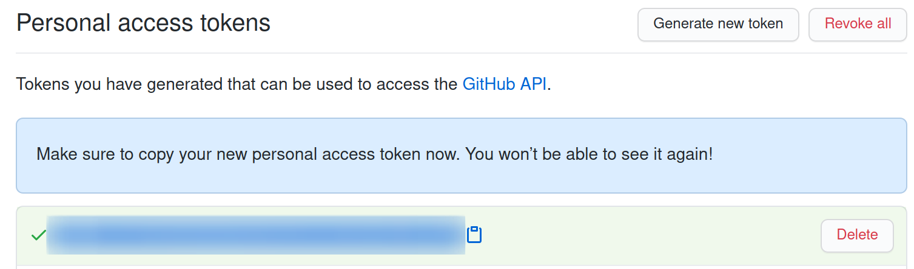

# Necessary Tokens

[](https://opensource.org/licenses/Apache-2.0)  [](https://creativecommons.org/licenses/by/4.0/) [](../NOTICE)

## GitHub

1. Visit [the new token page](https://github.com/settings/tokens/new)
2. Give it the `public_repo` scope

   
3. Copy the token somewhere

   
4. Export it as `WOTW_DAILY_PROG_GITHUB_TOKEN` in your shell. That's verbose but it's good design and you're only copypasting it once so why do you care?

   ```shell
   $ env | grep WOTW_DAILY_PROG_GITHUB_TOKEN
   WOTW_DAILY_PROG_GITHUB_TOKEN=qqq123
   ```

## Reddit

TBD
