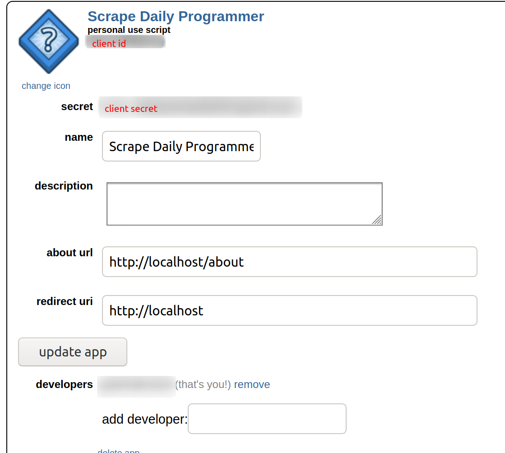

# Necessary Tokens

[](https://opensource.org/licenses/Apache-2.0)  [](https://creativecommons.org/licenses/by/4.0/) [](../NOTICE)

## GitHub

1. Visit [the new token page](https://github.com/settings/tokens/new)
2. Give it the `public_repo` scope

   
3. Copy the token somewhere

   
4. Export it as `WOTW_DAILY_PROG_GITHUB_TOKEN` in your shell. That's verbose but it's good design and you're only copypasting it once so why do you care?

   ```shell
   $ env | grep WOTW_DAILY_PROG_GITHUB_TOKEN
   WOTW_DAILY_PROG_GITHUB_TOKEN=qqq123
   ```

## Reddit

1. Create [a new reddit app](https://www.reddit.com/prefs/apps). Take note of your client ID and secret.

   
2. [Register at Reddit](https://www.reddit.com/wiki/api). You'll need the client ID of the app you just created.
3. Create a file called `.agentfile` in the directory you want to use for `daily-prog` (config coming later) that looks like this:

   ```
   user_agent: "<platform>:<app ID>:<version string> (by /u/<reddit username>)"
   client_id: "client id (looks kind of like: sdkfbwi48rhijwsdn)"
   client_secret: "client secret (looks kind of like: ldkvblwiu34y8hsldjivn)"
   username: "reddit username"
   password: "reddit password"
   ```
4. Make sure you're ignoring `.agentfile`!

This partially comes from [GRAW Registration docs](https://turnage.gitbooks.io/graw/content/chapter1.html). More information about agent files can be found [on the GRAW wiki](https://github.com/turnage/graw/wiki/agent-files).
